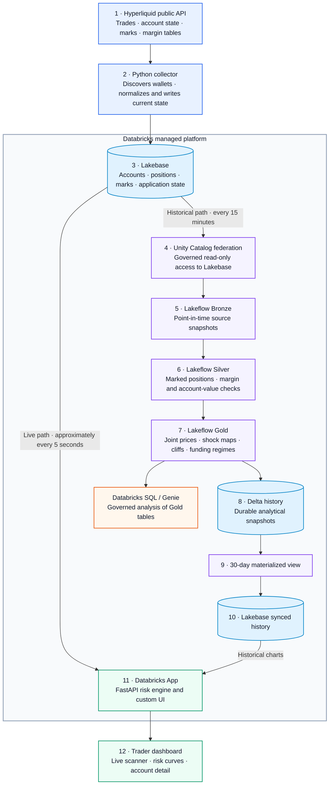

# PerpDesk

PerpDesk is a forward-looking liquidation risk map for Hyperliquid perpetuals. It computes exact
cross-margin solvency from public account state and the exchange's published tier formula instead
of inferring leverage from aggregate open interest.

The exchange's reported liquidation price is marginal: it holds every other price fixed. PerpDesk
solves the joint price, where the whole cross-margin book moves and shares account value. Every
notional is published with its tracked-open-interest coverage, so the result is explicitly a lower
bound rather than a market-total claim.

## What is implemented

- Pure Python maintenance-margin math, including missing margin-table IDs and tier deductions.
- An exact piecewise-linear joint liquidation solver checked against a brute-force shock oracle.
- A hybrid collector: discovery and account-state WebSockets, tiered REST polling, weight limiting,
  stable book hashing, and transactional closed-position deletion.
- A bounded Lakebase schema: Postgres keeps current state; Delta owns historical snapshots.
- A federated Lakeflow pipeline with maintenance-margin and account-value expectations.
- Gold joint-price, liquidation-map, cliff, and funding-regime outputs plus a history append Job.
- Genie instructions and benchmarks, including questions the agent should decline.
- A standalone FastAPI application with a custom responsive frontend. It does not reuse Streamlit
  or ChainPulse UI code.

## Architecture



The live path bypasses the 15-minute historical pipeline: Lakebase serves current state directly to
the application, while Lakeflow independently validates and preserves governed historical risk.

Lakebase CDF is intentionally absent. On Databricks Free Edition its managed default-storage
destination is unsupported. Federation reads a bounded current-state contract, while a second Job
task appends each computed map to Delta history.

### How Databricks fits into the stack

Databricks owns the managed state, historical computation, governance, and analytical serving
layers; it is not the source of Hyperliquid data. The collector writes a bounded current-state
contract to Lakebase. The live application reads that contract directly and recomputes the current
risk view approximately every five seconds, so it does not wait for the historical pipeline.

Separately, a scheduled Databricks Job uses Unity Catalog federation to take a governed snapshot of
Lakebase every 15 minutes. Lakeflow builds Bronze point-in-time inputs, Silver marked positions and
reconciliation checks, and Gold joint-liquidation outputs. The Job appends those results to Delta,
maintains a bounded 30-day materialized view, and syncs the history back to Lakebase for the app.
The same Gold tables form the controlled SQL and Genie surface.

### Why Databricks is used

Databricks is not required to call Hyperliquid or run the liquidation solver. Its main advantage is
consolidating several capabilities into one managed, governed platform:

- **Operational state:** Lakebase holds the bounded account, position, market, and application state.
- **Managed transformation and orchestration:** Lakeflow and Jobs order the snapshot, validation,
  Gold-table, history-append, and sync steps and expose their run status.
- **Data quality:** pipeline expectations continuously reconcile computed maintenance margin and
  account value against the exchange-reported values.
- **Durable analytical history:** Delta owns historical snapshots while Lakebase remains a small,
  responsive current-state store.
- **Governance and discoverability:** Unity Catalog provides a common namespace, permissions, and
  lineage for source views, pipeline outputs, and downstream consumers.
- **Serving and analysis:** Databricks SQL, Genie, synced tables, and Databricks Apps expose the same
  governed results to analysts and the product UI.

Without that consolidation, the same outcome would require separately selecting and operating an
OLTP database, distributed compute engine, scheduler, object-store table format, data-quality
framework, catalog, SQL serving layer, and application deployment environment. That integration is
the Databricks benefit; the live risk mathematics remains PerpDesk's application logic.

## Run locally

Python 3.11+ is recommended.

```bash
python3 -m venv .venv
.venv/bin/pip install -r requirements-dev.txt
cp .env.example .env
.venv/bin/uvicorn app.main:app --reload
```

Open `http://127.0.0.1:8000`. `.env.example` enables deterministic demo mode, so the complete UI
works without Databricks credentials. Set `PERPDESK_DEMO_MODE=false` to read Lakebase.

```bash
.venv/bin/python -m pytest -q
.venv/bin/python -m compileall -q app perpdesk pipelines
```

## Databricks setup

The cloud resources require your workspace, Lakebase project, and service-principal values. The
repo contains deployable definitions and keeps all secrets out of source control.

1. Create a Lakebase Autoscaling PG17 project and run [sql/01_schema.sql](sql/01_schema.sql) in
   its SQL editor.
2. Create the `perpdesk-collector` service principal, replace the placeholder UUID, then run
   [sql/02_roles.sql](sql/02_roles.sql). The collector uses `databricks_auth`; there is no database
   password in the system.
   If an admin creates the tables before applying the role grants, run
   [sql/02_grants_existing.sql](sql/02_grants_existing.sql) afterward as well.
3. Run [sql/03_seed.sql](sql/03_seed.sql), [sql/03_lakehouse_views.sql](sql/03_lakehouse_views.sql),
   and [sql/lakebase_04_live_risk_view.sql](sql/lakebase_04_live_risk_view.sql).
4. Register Lakebase as a read-only Unity Catalog PostgreSQL connection and create the foreign
   catalog `perpdesk_pg`. Verify all four `*_lakehouse` views before collecting data.
5. Fill `.env`, bootstrap one pass, then start the collector:

   ```bash
   .venv/bin/python -m perpdesk.collector.main --once
   .venv/bin/python -m perpdesk.collector.main
   ```

   To seed a large newline-delimited wallet universe, import it once before
   starting (or restarting) the collector:

   ```bash
   .venv/bin/python -m perpdesk.collector.main \
     --wallet-file /absolute/path/to/wallets.txt --import-only
   ```

   Imported wallets enter the T2 REST queue; they are not promoted to the T0
   WebSocket tier. `PERPDESK_NEW_ACCOUNT_SHARE` controls how much of each T2
   cycle scans never-seen addresses, with unused capacity returning to normal
   oldest-first refreshes. The Accounts UI intentionally shows at most 40
   liquidation roots; that display cap is not the number stored or polled.

6. Set the bundle variables and deploy [databricks.yml](databricks.yml). The single pipeline writes
   to `workspace.perpdesk`; its downstream Job refreshes the pipeline, appends history, refreshes
   the bounded 30-day materialized view, and then refreshes the Lakebase synced table every 15
   minutes. The Job allows only one concurrent run.
7. Run [sql/04_gold_tables.sql](sql/04_gold_tables.sql), then create the synced tables described in
   [sql/06_app_synced_tables.sql](sql/06_app_synced_tables.sql).
8. Create a Genie space using only the gold outputs and paste in
   [genie/instructions.md](genie/instructions.md). Record benchmark results beside
   [genie/benchmarks.yaml](genie/benchmarks.yaml), including correct refusals.
9. Deploy the repository as a Databricks App using the bundle resource and GitHub Actions workflow.
   The app configuration at [app.yaml](app.yaml) binds the Lakebase resource without storing
   credentials. Follow the complete one-time identity, database-grant, deployment, and sharing
   procedure in [DEPLOYMENT.md](DEPLOYMENT.md).

The historical path runs every 15 minutes. The live dashboard still reads Lakebase directly and
refreshes independently every five seconds.

## Correctness contract

```text
mmr(k)       = 1 / (2 × max_leverage(k))
ded(k)       = ded(k−1) + lower_bound(k) × (mmr(k) − mmr(k−1))
mm(notional) = notional × mmr(k) − ded(k)
```

At a single-asset multiplier `s`, `AV(s) − MM(s)` is linear inside each tier with a strictly signed
slope. The solver returns the exact adverse root. Tests compare classifications at several shocks
against direct account-value and maintenance-margin recomputation.

Captured mainnet fixtures established the external anchor before the pipeline was built: 10/10
accounts matched exchange-reported cross maintenance margin, with worst relative error `3.75e-7`.
The pipeline threshold is `1e-6`; failures are counted, never dropped.

## Model boundary

- Coverage is partial. Values are lower bounds over tracked accounts.
- Positions are as of last observation and are re-marked consistently at capture.
- Isolated positions are not blended into the cross-margin result.
- The model says what becomes liquidatable under a shock. It does not predict executions, price
  impact, liquidity, or how accounts will add margin in response.
- No signing key, wallet connection, or trading path exists in the repository.

The detailed platform rationale and phase record are in [PLAN.md](PLAN.md).
